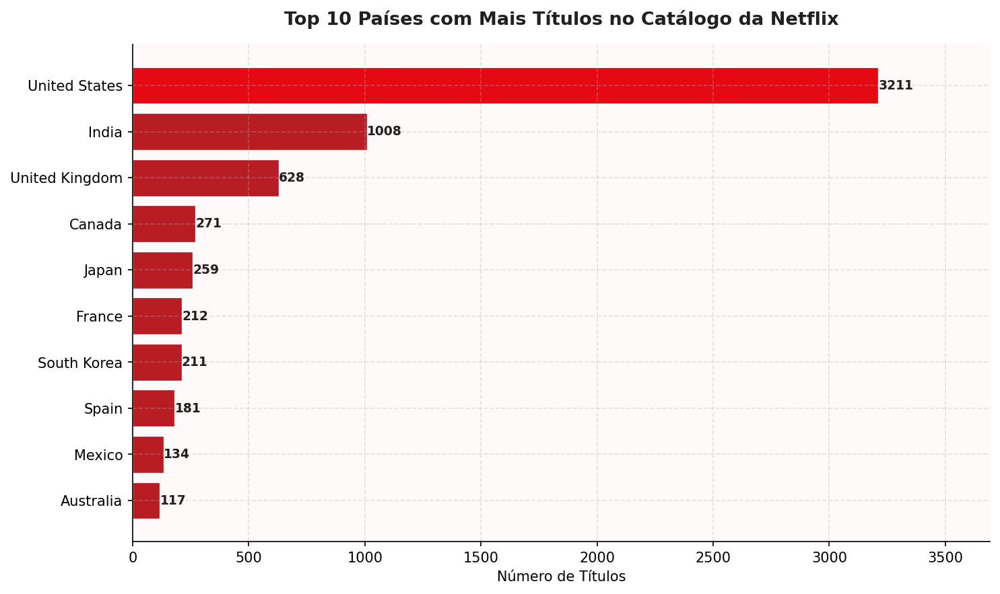
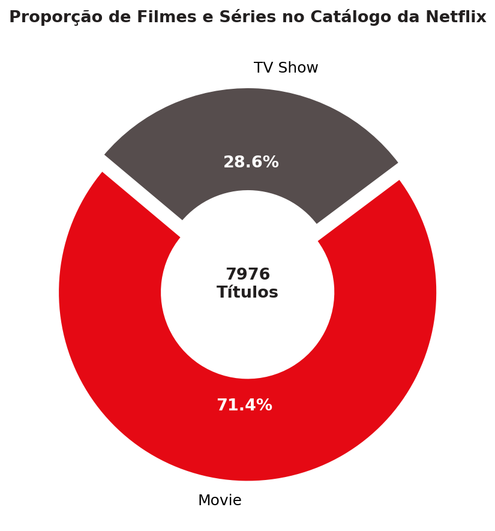
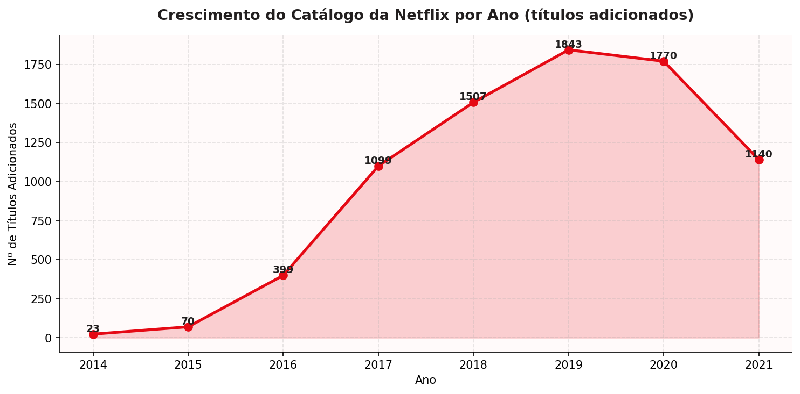

# 🎬 Análise do Catálogo da Netflix

Projeto de visualização de dados desenvolvido em Python, com base no dataset público **Netflix Movies and TV Shows**, disponível no Kaggle.

---

## 📊 Sobre o Projeto

Este projeto analisa o catálogo da Netflix e responde três perguntas principais através de gráficos:

- Quais países produzem mais conteúdo na Netflix?
- O catálogo tem mais filmes ou séries?
- Como o catálogo cresceu ao longo dos anos?

---

## 📁 Dataset

- **Nome:** Netflix Movies and TV Shows
- **Fonte:** [Kaggle — shivamb/netflix-shows](https://www.kaggle.com/datasets/shivamb/netflix-shows)
- **Arquivo:** `netflix_titles.csv`

---

## 🛠️ Tecnologias Utilizadas

- Python 3
- Pandas
- Matplotlib
- NumPy

---

## 📈 Gráficos Gerados

### 1. Top 10 Países com Mais Títulos — Barras Horizontais
Compara os dez países com maior número de títulos no catálogo.



---

### 2. Proporção Filmes vs Séries — Donut
Mostra a composição do catálogo entre filmes e séries.



---

### 3. Crescimento do Catálogo por Ano — Linha com Área
Exibe a evolução da quantidade de títulos adicionados por ano.



---

## ▶️ Como Rodar

1. Clone o repositório:
```bash
git clone https://github.com/SEU_USUARIO/analise-netflix.git
```

2. Instale as dependências:
```bash
pip install pandas matplotlib numpy
```

3. Baixe o dataset no [Kaggle](https://www.kaggle.com/datasets/shivamb/netflix-shows) e coloque o arquivo `netflix_titles.csv` na pasta do projeto

4. Execute o script:
```bash
python analise_netflix.py
```

---

## 👩‍💻 Autora

Maria Luiza Machado
